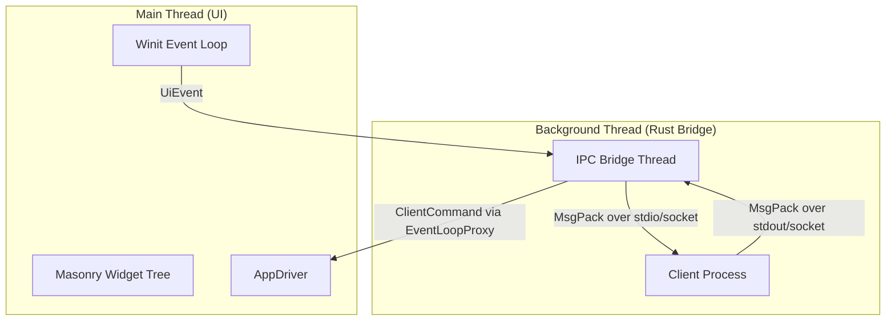

# architecture.md

This document provides an overview of the `Vellum UI` codebase structure, component
responsibilities, and interaction flows.

## 1. High-Level Architecture

`Vellum UI` uses a **dual-threaded + subprocess architecture** to keep rendering
responsive while running JavaScript logic externally.

- **UI Thread**: Handles window management, rendering, and user input.
- **IPC Bridge Thread**: Concurrently runs external clients (e.g. Bun), forwards UI events, and maps client messages
  into typed `ClientCommand`s.
- **IPC**: Uses length-prefixed MsgPack frames over stdio/sockets for cross-process
  transport.

## 2. Folder Structure & Responsibilities

### `src/`

- **`main.rs`**: Entry point. Initializes UI, creates channels, and spawns the
  JS bridge thread.

### `src/ipc/`

Defines shared communication types and protocol helpers.

| File              | Description                                                                        |
| ----------------- | ---------------------------------------------------------------------------------- |
| **`mod.rs`**      | Module exports.                                                                    |
| **`channels.rs`** | In-process channel wiring (`UiEventSender`, `UiEventReceiver`, `ClientCommandSender`). |
| **`commands.rs`** | `ClientCommand` enum and widget/style types sent from the client to UI.                    |
| **`events.rs`**   | `UiEvent` enum sent from UI to the client.                                             |
| **`color.rs`**    | Shared `ColorValue` parsing and representation.                                    |
| **`msgpack.rs`**  | MsgPack protocol messages (`ClientMessage`, `ServerMessage`) and length-prefixed framing.             |

### `src/ipc/server.rs`

Hosts the Rust side of the subprocess bridge.

| File                  | Description                                                                               |
| --------------------- | ----------------------------------------------------------------------------------------- |
| **`server.rs`**          | Binds to a UDS/Named Pipe, streams MsgPack frames, and maps protocol messages to `ClientCommand`. |

### `src/ui/` (formerly `ui_thread`)

Handles native UI behavior via `masonry`.

| File                    | Description                                                       |
| ----------------------- | ----------------------------------------------------------------- |
| **`mod.rs`**            | Builds event loop and runs UI.                                    |
| **`driver.rs`**         | `Vellum UIDriver` bridges Masonry actions and incoming `ClientCommand`s.  |
| **`handler.rs`**        | Central command dispatcher that mutates widgets and window state. |
| **`creation.rs`**       | Widget creation helpers.                                          |
| **`styles.rs`**         | Style conversion helpers.                                         |
| **`widget_manager.rs`** | Tracks parent-to-child relationships in O(1) mappings for Masonry `WidgetId`s. |
| **`layout.rs`**         | Initial layout helpers.                                           |

### `packages/core/src/`

JavaScript runtime package and Vellum runtime bootstrap.

| File                | Description                                                               |
| ------------------- | ------------------------------------------------------------------------- |
| **`bun_bridge.ts`** | Runtime bridge module initialized when `@vellum/core` is imported in Bun. |
| **`ops.ts`**        | Bridge-backed command API used by `@vellum/core`.                       |
| **`events.ts`**     | Event subscription layer fed by bridge-pushed UI events.                  |
| **`index.ts`**      | Public JS API surface (`window`, `ui`, widgets, events, logging).         |

## 3. Runtime Flow

1. **`bun run <script.ts>`** executes the user script.
2. Importing `@vellum/core` initialized the client process bridge (`bun_bridge.ts`), generating a Socket path.
3. Bun spawns the Rust **`vellum.exe`** binary as a subprocess and connects to the UDS/Named Pipe socket.
4. **`main.rs`** creates UI event loop and IPC channels, then spawns the IPC bridge thread which listens for the socket connection.
5. UI actions produce `UiEvent` values which are MsgPack-encoded and streamed from Rust to the client over the socket.
6. Client runtime API emits command messages back over MsgPack via the socket.
7. Rust bridge decodes messages to `ClientCommand` and dispatches to UI via `EventLoopProxy`.

## 4. Key Concepts

- **Typed core messages**: Internal state transitions remain strongly typed
  (`UiEvent`, `ClientCommand`).
- **Process isolation**: JavaScript runs out-of-process in Bun instead of inside
  Rust.
- **Non-blocking UI**: UI thread stays focused on rendering/input while IPC
  happens on the bridge thread.
