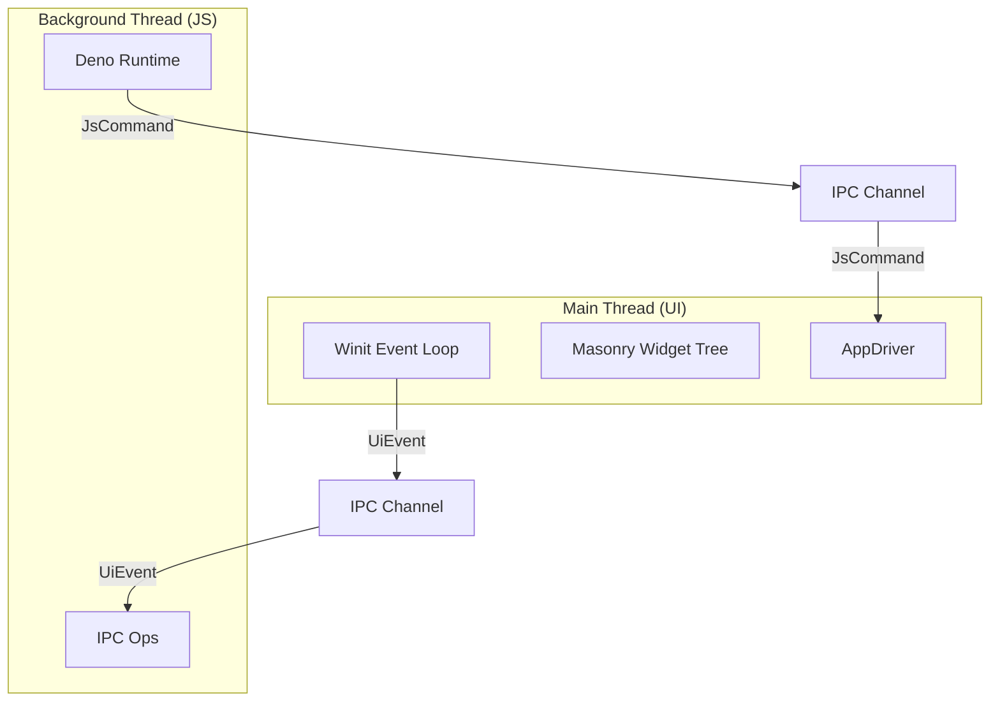

# codebase_structure.md

This document provides a comprehensive overview of the `appjs` codebase structure, component responsibilities, and interaction flows.

## 1. High-Level Architecture

`appjs` uses a **dual-threaded architecture** to ensure the UI remains responsive while executing JavaScript logic.

- **UI Thread**: Handles window management, rendering, and user input.
- **JS Thread**: Runs the V8/Deno engine, executes business logic, and sends commands to update the UI.
- **IPC**: Uses `std::sync::mpsc` channels to pass messages between threads.

## 2. Folder Structure & File Responsibilities

### `src/` Root
- **`main.rs`**: The entry point. Initializes the JS thread, sets up the channels, creates the Winit event loop, and launches the application.

### `src/ipc/` (Inter-Process Communication)
Defines the shared types and communication primitives used by both threads.

| File | Description |
|---|---|
| **`mod.rs`** | Module exports. |
| **`channels.rs`** | Defines `AppChannel` struct to bundle sender/receiver pairs. |
| **`commands.rs`** | Defines `JsCommand` enum (e.g., `CreateWidget`, `SetStyle`) sent **from JS to UI**. |
| **`events.rs`** | Defines `UiEvent` enum (e.g., `WidgetAction`) sent **from UI to JS**. |
| **`color.rs`** | Shared `ColorValue` enum and parsing logic. |

### `src/ui_thread/` (Main Thread)
Handles the visual aspect of the application using the `masonry` library.

| File | Description |
|---|---|
| **`mod.rs`** | Module exports and `run_ui_loop` function. |
| **`driver.rs`** | `AppJsDriver` acts as the bridge. It implements `AppDriver` to receive Masonry actions and `JsCommand`s from the channel. |
| **`handler.rs`** | The central logic for processing `JsCommand`s. Delegates specific tasks to `creation.rs` and `styles.rs`. |
| **`creation.rs`** | Factory logic to create Masonry widgets (`Button`, `Label`, `Flex`) from `JsCommand` parameters. |
| **`styles.rs`** | Helpers to convert `WidgetStyle` (from IPC) into Masonry `StyleProperty` and implementations. |
| **`widget_manager.rs`** | Maintains a mapping between the string-based IDs used in JS and the `WidgetId`s used by Masonry. |

### `src/js_thread/` (Background Thread)
Hosts the Deno runtime environment.

| File | Description |
|---|---|
| **`mod.rs`** | Module exports and logic to initialize and run the Deno runtime loop. |
| **`appjs.js`** | The JavaScript runtime preamble. Defines the global `app` object and helper functions. |
| **`ipc_ops.rs`** | Defines Rust functions exposed to JavaScript (using `#[op2]`). Acts as the interface for JS to send commands. |
| **`style_parser.rs`** | Parses raw JSON style strings from JS into strong Rust `WidgetStyle` structs. |
| **`event_serializer.rs`** | Serializes Rust `UiEvent`s into JSON strings to be dispatched to JavaScript event listeners. |
| **`console_ops.rs`** | Handles `console.log` and other output from the JS runtime. |

### `src/ui_thread/` (Main Thread)
Handles the visual aspect of the application using the `masonry` library.

| File | Description |
|---|---|
| **`mod.rs`** | Module exports and `run_ui_loop` function. |
| **`driver.rs`** | `AppJsDriver` acts as the bridge. It implements `AppDriver` to receive Masonry actions and `JsCommand`s from the channel. |
| **`handler.rs`** | The central logic for processing `JsCommand`s. Delegates specific tasks to `creation.rs` and `styles.rs`. |
| **`creation.rs`** | Factory logic to create Masonry widgets (`Button`, `Label`, `Flex`) from `JsCommand` parameters. |
| **`styles.rs`** | Helpers to convert `WidgetStyle` (from IPC) into Masonry `StyleProperty` and implementations. |
| **`widget_manager.rs`** | Maintains a mapping between the string-based IDs used in JS and the `WidgetId`s used by Masonry. |
| **`layout.rs`** | Helper definitions for Masonry layout constructs (if used). |

### Startup Flow
1.  **`main.rs`**: Creates channels. Spawns JS thread. Starts UI event loop.
2.  **JS Thread**: Initializes Deno. Loads the target script (e.g., `index.js`).
3.  **UI Thread**: Opens the window and waits for commands.

### Widget Creation (JS -> UI)
1.  **JS**: Calls `app.createWidget("my_btn", "Button")`.
2.  **`ipc_ops.rs`**: Receives call. Constructs `JsCommand::CreateWidget`. Sends via channel.
3.  **`driver.rs`**: Polls channel. Receives command. Passes to `handler.rs`.
4.  **`handler.rs`**: Calls `creation::create_widget`.
5.  **`widget_manager.rs`**: Stores mapping `"my_btn" -> WidgetId(1)`.
6.  **`masonry`**: Renders the new button.

### Event Handling (UI -> JS)
1.  **User**: Clicks the button.
2.  **`driver.rs`**: Intercepts `WidgetAction::Click`. Finds JS ID `"my_btn"`.
3.  **`ipc/events.rs`**: Constructs `UiEvent::WidgetAction { id: "my_btn", action: Click }`. Sends via channel.
4.  **`js_thread`**: Loop receives event.
5.  **`event_serializer.rs`**: Converts to JSON `{"type": "widgetAction", "id": "my_btn", ...}`.
6.  **JS**: Triggers the registered event listener callback.

## 4. Key Concepts
- **Asynchronous Communication**: The two threads never block each other.
- **Stateless UI (mostly)**: The JS thread is the source of truth for application state. The UI thread is a view.
- **Idempotent Updates**: Re-sending style updates overwrites previous states.
